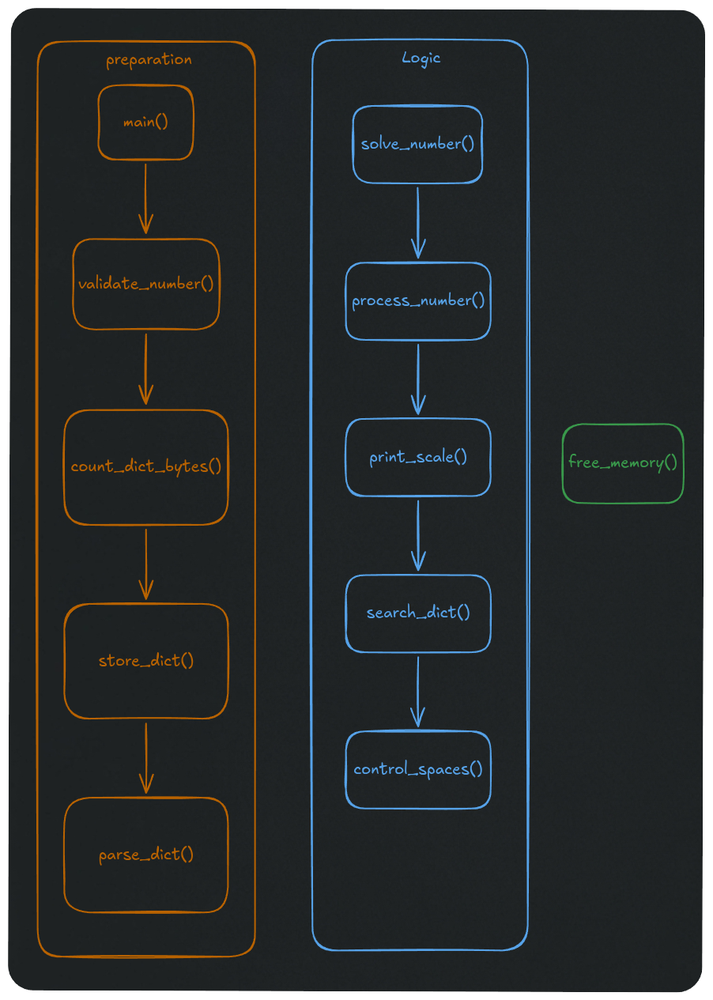

# Plan de funciones


### 'numbers.h'
```c
#ifndef NUMBERS_H
#define NUMBERS_H

/* 1. Librerías permitidas */
#include <fcntl.h>   // Para open, O_RDONLY
#include <unistd.h>  // Para read, write, close, ssize_t
#include <stdlib.h>  // Para malloc, free, size_t

/* 2. Definición de la estructura del Diccionario */
typedef struct s_dict
{
    char    *key;   // Almacena la cifra como texto (ej: "20", "100", "1000")
    char    *value; // Almacena la palabra correspondiente (ej: "twenty", "hundred")
}   t_dict;

/* Fase 1: Preparation (Preparación) */
int     validate_number(char *str);
size_t  count_dict_bytes(char *dict_path);
char    *store_dict(char *dict_path, size_t size);
t_dict  *parse_dict(char *raw_buffer, int *total_elements);

/* Fase 2: Logic (Lógica) */
void    solve_number(char *num_str, t_dict *dict, int total_elements);
void    process_number(char *block, int scale, t_dict *dict, int total_elements);
void    print_scale(int scale, t_dict *dict, int total_elements);
char    *search_dict(t_dict *dict, int total_elements, char *key);
void    control_spaces(int reset);

/* Fase 3: Clean up (Limpieza) */
void    free_memory(t_dict *dict, int total_elements);

#endif

```
